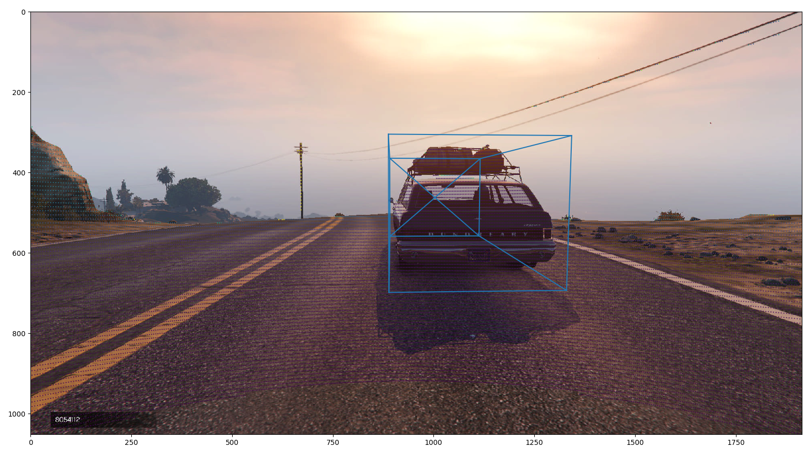
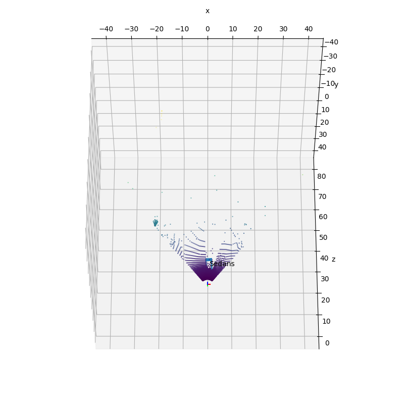
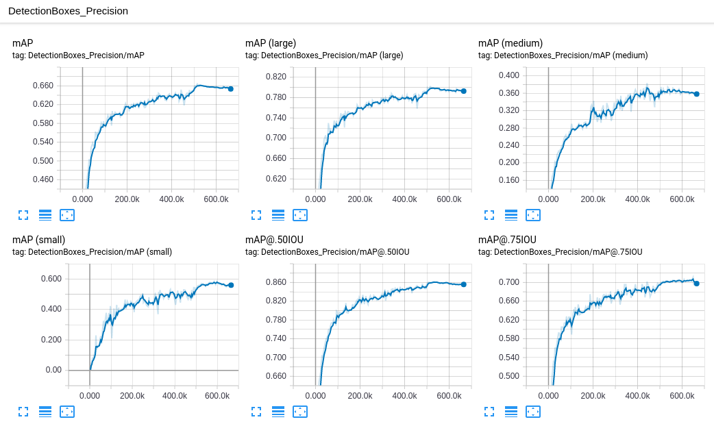
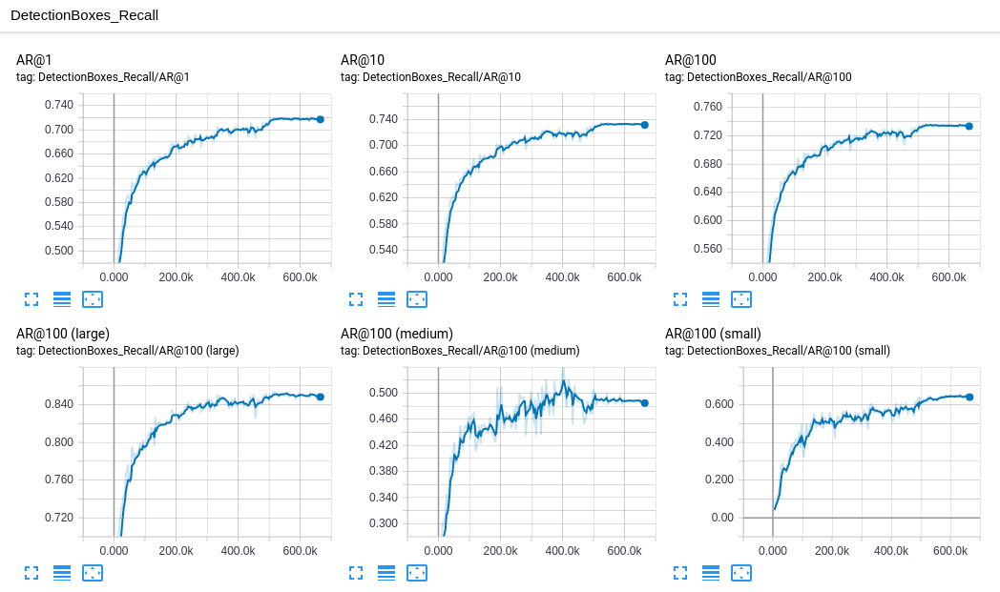
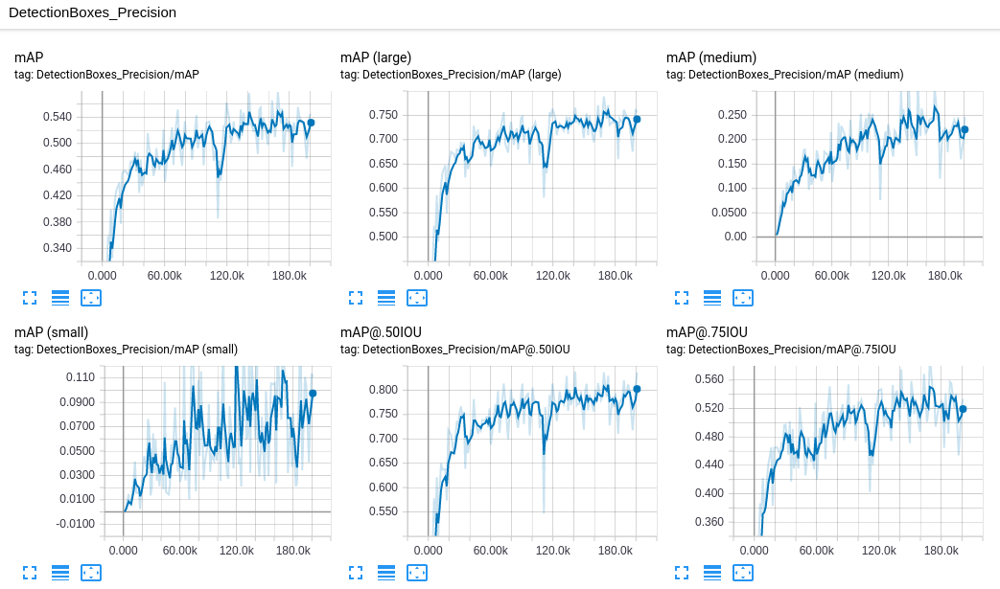
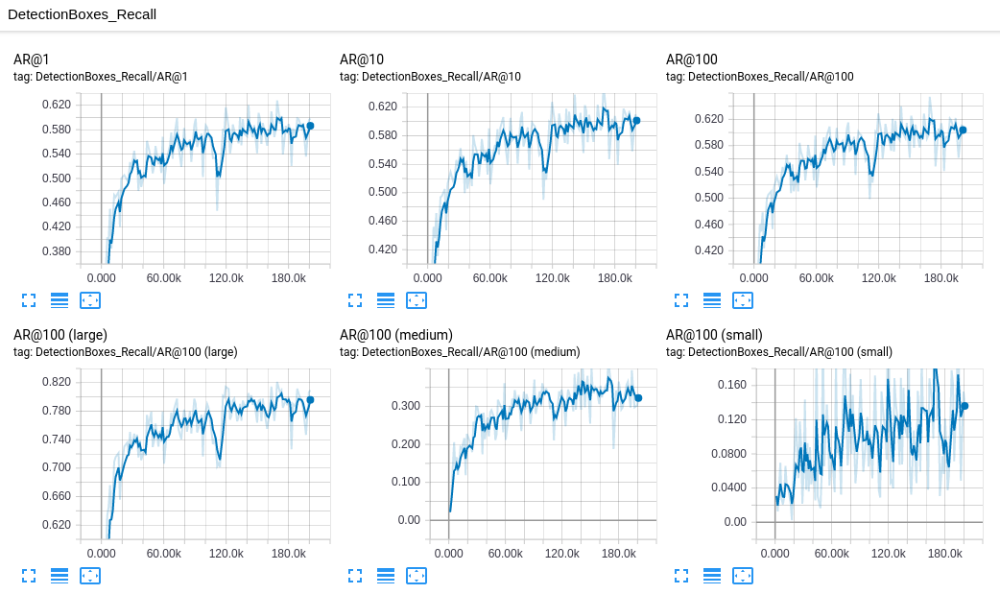
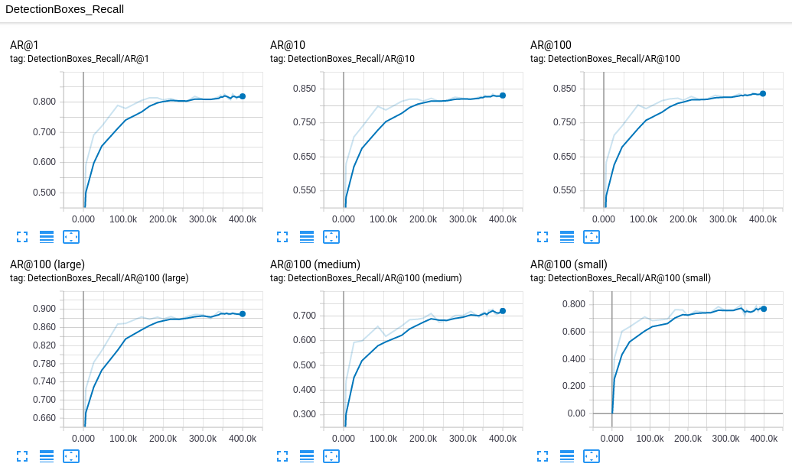
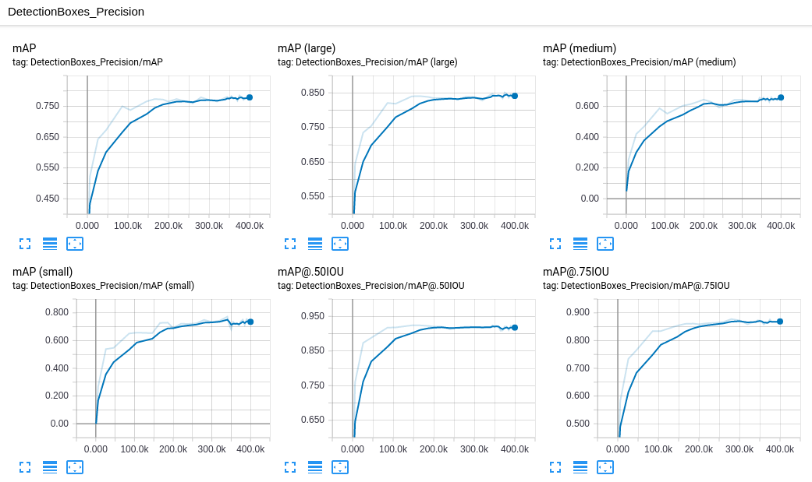
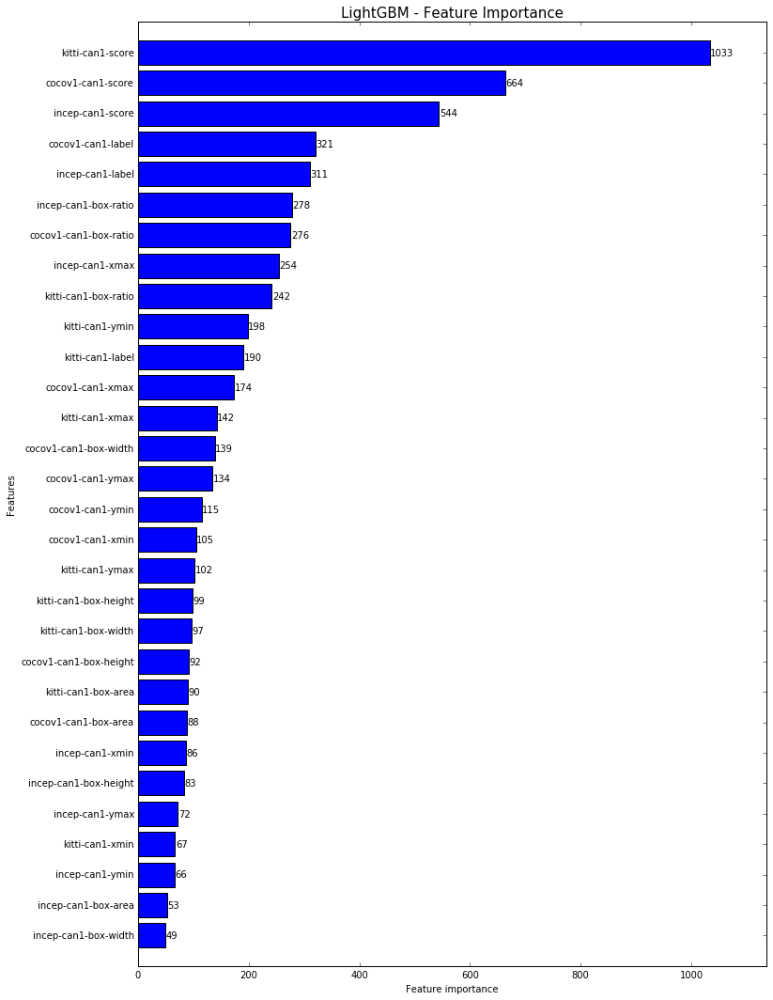

# ROB 535 Course Project: Perception (Fall 2018)

The course, ROB 535 (Self Driving Cars: Perception and Control), is one of the autonomous vehicle courses offered at University of Michigan. In Fall 2018 semester, the final project contains two independent parts: **Perception** and **Control**, each part with two tasks. This repo contains a step-by-step tutorial from our team for the **Perception** part. A more brief PDF report can be found [here](./report/rob535-perception-report.pdf).

For the **Control** part, check out [this repo](https://github.com/xuwenzhe/rob535-control).


## 1. Task
The **Perception** part contains two tasks: 

1. **Classifying** vehicles in images from a game engine by predicting categories labels 0, 1, and 2. (number of classes = 3)
2. **Localizing** vehicles in images from a game engine by giving centroids' coordinates (x,y,z)

Both tasks share the same dataset, provided by the course.

### 1.1 Data
The dataset contains 10204 snapshots from Grand Theft Auto (GTA) game engine, where 7573 of them are used for training and the other 2631 are used for testing. Each snapshot contains an RGB image (`*image.jpg`), a point cloud (`*cloud.bin`), the camera matrix (`*proj.bin`), and a list of 3D bounding boxes (`*bbox.bin`). The given dataset assumes there is only one vehicle in a snapshot, though this repo can handel multi-object scenerios. Note that the `*bbox.bin` files for testing are intentionally **NOT** provided since they contain labels that this project asks to predict.




The 3D box in the snapshot is generated using corresponding `*bbox.bin` and `*proj.bin` files. The `*bbox.bin` file contains an array with 11 columns. Each row contains information of a bounding box (in this project, assume one row): rotation vector, position (centroid x, y, z), size of the bounding box (length, width, height), class id, and a flag. The mapping from class id to the type of vehicle and corresponding labels is provided in `classes.csv`. The flag (last column) is not used in this project. A helper python3 script to produce these plots can be found [here](./utils/demo.py).

Though the `*cloud.bin` files are provided, we did not use these data to train the model due to limited time left for this project. All the other available data were used to train various CNN models via Tensorflow API. Interested readers can follow the procedures, given in the **Tutorial** section, to reproduce our work.

## 2. Results
Three pre-trained CNNs are re-trained and tested for comparison. Their number of training steps, batch size, test accuracy (measured by missing rate), and training time are listed below.

| CNN name | # training steps | batch size | test accuracy | training time |
| ------------- | ------------- | ------------- | ------------- | ------------- |
| faster\_rcnn\_resnet101\_kitti  | 665,352  | 1 | 0.68871 | 34 h |
| ssd\_mobilenet\_v1\_coco  | 200,977  | 24 | 0.71607 | 24 h |
| faster\_rcnn\_inception\_resnet\_v2\_atrous\_coco  | 200,000  | 1 | 0.71721 | 45 h |

Their average Precision and average Recall during training are shown below.

**faster\_rcnn\_resnet101\_kitti**





**ssd\_mobilenet\_v1\_coco**





**faster\_rcnn\_inception\_resnet\_v2\_atrous\_coco**





LightGBM is used then to combine classification results based on CNN predicted features, including bounding box locations, widths, heights, area, ratio, and classification confidence score. The blended submission is scored at 0.74268 on the leaderboard, which is ranked 3rd among all participated teams. Considering this submission only uses 2D image data, the approach is effective. The importance of features can be generated using lightGBM, shown below.



For task2, '1-nearest neighbor' approach is used. The main idea is to find the most similar bounding box in the training set for each image in the test set, and then assign the centroid's coordinate of the searched image. This trivial method is scored at 15.18059 (top 25%) according to the leaderboard.

## 3. Tutorial
Task1 is to classify the vehicle in each test image into one of three categories: encoded as 0, 1, and 2. Task2 is to localize the vehicle in each test image by giving its centroid's coordinates (x,y,z). Since task2 is solved based on our results from task1, the following step-by-step tutorial first explains task1, followed by task2.

### 3.1 Install TensorFlow
[TensorFlow](https://www.tensorflow.org/), a deep-learning framework developed by Google, and its object detection API is used in this project. A [Docker](https://www.docker.com/) image, provided by TensorFlow is founded to be the easiest way to install TensorFlow. Since the training workload is heavy for this project, `tensorflow/tensorlow:latest-gpu`, a GPU-supported TensorFlow Docker image is highly recommended. The GPU device is GTX-1080Ti (compute capability = 6.1). Check out [this](https://www.tensorflow.org/install/docker) for more details about tensorflow installation.

### 3.2 Install TensorFlow Object Detection API

Check out [this](https://github.com/tensorflow/models/tree/master/research/object_detection) to install TensorFlow Object Detection API

Troubleshoot:

During installation, an incompatible protobuf error can be fixed by downloading > 3.0 release of protoc and running the compilation process again.

```
Downloads/protoc-3.6.1-linux-x86_64/bin/protoc object_detection/protos/*.proto --python_out=.
```

Adding the following line to bashrc is recommended

```
export PYTHONPATH=$PYTHONPATH:`pwd`:`pwd`/slim
```

### 3.3 Prepare TFRecords
`TFRecords` are space-efficient Dataset format to train the model. In this step, we are to generate `.record` files. 

We first aggregate all images into two folders (`images/train` and `images/test`) by copying and renaming them (replace `/` by `-`) using [this script](./utils/agg_img.py), then extract the prediction labels with 2D bounding box for all training images using [this script](./utils/gen_labels.py). We split the given training set into the `dev` set for training and the `val` set for validation using [this script](./utils/split_validation_dataset.py). The `dev` and `val` are splitted with ratio 0.9:0.1 after shuffled.

Once the 'image' files and 'label' files are ready, [this script](./utils/generate_tfrecord.py) modified from [datitran's github](https://github.com/datitran/raccoon_dataset/blob/master/generate_tfrecord.py) is used to generated `.record` files.

```
python3 generate_tfrecord.py --csv_input=data/train_labels.csv --output_path=data/train.record
python3 generate_tfrecord.py --csv_input=data/test_labels.csv --output_path=data/test.record
```

A `.pbtxt` schema file should be generated as well with '0' left as placeholder.

```
item {
    id: 1
    name: 'label0'
}

item {
    id: 2
    name: 'label1'
}

item {
    id: 3
    name: 'label2'
}
```

All 5 files (`rob535-task1.pbtxt`, `test.record`, `test_labels.csv`, `train.record`, `train_labels.csv`) are put into one folder (`rob535-task1-data`), which is then copied to a docker running container for TensorFlow training.

A running docker container can be commited as a docker image by:

```
docker ps
docker commit containerid username/imagename:versionid
```

Run a docker image with port binding (8888 for jupyter notebook and 6006 for tensorboard) by:

```
docker run --runtime=nvidia -it -p 8888:8888 -p 6006:6006 imagename:imagetag bash
```

Run jupyter notebook inside docker container:

```
jupyter notebook --allow-root
```

### 3.4 Config CNNs
Three CNN architectures are trained and tested as a comparison. Their configuration files are located under `config` folder. Users should change "PATH_TO_BE_CONFIGURED" to thier own file paths. The `num_classes` is set to 3 in this project. Inceasing `classification_loss_weight` compared to `localization_loss_weight` wasn't found to be helpful in classifying vehicles. 

### 3.5 Train CNNs
To show the training process for every step, add `tf.logging.set_verbosity(tf.logging.INFO)` after the import section of the model_main.py script.

```
# train CNNs using library script: model_main.py
python model_main.py --logtostderr --model_dir=training/ --pipeline_config_path=training/faster_rcnn_resnet101_kitti.config

python model_main.py --logtostderr --model_dir=training/ --pipeline_config_path=training/ssd_mobilenet_v1_coco.config

python model_main.py --logtostderr --model_dir=training/ --pipeline_config_path=training/faster_rcnn_inception_resnet_v2_atrous_coco.config
```

The training process and results are shown in the **Results** section.

Use `tensorboard` to show the training process.

```
tensorboard --logdir='training'
```

### 3.6 Export CNNs and Infer Predictions
An example command to export a training graph is given as follows. 

```
python export_inference_graph.py \
    --input_type image_tensor \
    --pipeline_config_path training/faster_rcnn_inception_resnet_v2_atrous_coco.config \
    --trained_checkpoint_prefix training/model.ckpt-200000 \
    --output_directory exported_200000
```
A notebook generating predictions is given [here](./notebook/graph_inference.ipynb).

### 3.7 Model Blending using LightGBM
Each one of three CNNs can provide predictions on both training set and test set. Important features like box coordinates, widths, heights, area, ratio, predicted labels, and confidence scores are extracted and fed into lightGBM to conduct model blending. These feature files can be found under `RCNNfeatures` folder and the notebooks generating these features are at [here](./notebook/prepare_lgb_train.ipynb) and [here](./notebook/prepare_lgb_test.ipynb). The notebook conducting results blending is given [here](./notebook/lgb_model.ipynb).

### Task2 Method
Based on CNN features from task1, vehicles' centroids can be found using a trivial '1-nearest neighbor'. For each image to be localized centroid, CNN will generate a 2D bounding box. Search in the 2D bounding box pool from the training set and find the most similar bounding box and return its centroid coordinates xyz. The similarity measure is L2 norm among 2 diagonal corners of the box.

$$(ymin-ymin_i)^2 + (xmin-xmin_i)^2 + (ymax-ymax_i)^2 + (xmax-xmax_i)^2$$
 
A notebook generating the centroid predictions is given [here](./notebook/task2_similar_2d_box.ipynb)

## Acknowledgment
We appreciate Prof. Matthew Johnson Roberson, and Prof. Ram Vasudevan for developling this course and all our GSI for providing help. Thank you all for efforts from our team members:

Pengcheng Cai, Zhaoer Li, Sisi Luo, Mingshuo Shao, Xuetong Sun, Yichuan Wang, Huiwen Xu, Wenzhe Xu, Haixuan Ye, Yan Zhang

## Reference

